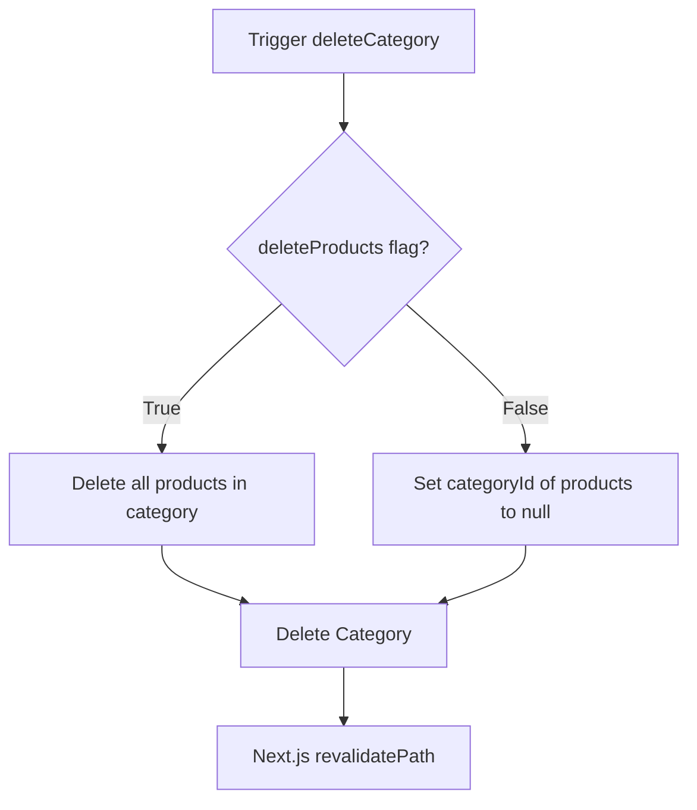

# Developer Guide: Category & Custom Field System

This document outlines the architecture, database schema, and server mutations for the recursive category tree and EAV-based dynamic product fields system.

---

## 1. Database Schema & Relations

The system is built on Prisma (PostgreSQL) using a self-referencing hierarchy for categories and an Entity-Attribute-Value (EAV) model for dynamic product fields.

```prisma
model Category {
  id            String     @id @default(cuid())
  name          String
  isHidden      Boolean    @default(false)
  parentId      String?
  parent        Category?  @relation("SubCategories", fields: [parentId], references: [id], onDelete: SetNull)
  subcategories Category[] @relation("SubCategories")
  products      Product[]
  createdAt     DateTime   @default(now())
  updatedAt     DateTime   @updatedAt
}

model Product {
  id          String         @id @default(cuid())
  name        String
  isHidden    Boolean        @default(false)
  categoryId  String?
  category    Category?      @relation(fields: [categoryId], references: [id], onDelete: SetNull)
  fields      ProductField[]
  createdAt   DateTime       @default(now())
  updatedAt   DateTime       @updatedAt
}

model ProductField {
  id          String     @id @default(cuid())
  productId   String
  product     Product    @relation(fields: [productId], references: [id], onDelete: Cascade)
  name        String
  type        FieldType  // STRING | NUMBER_UNIT | PHOTO
  stringValue String?
  numberValue Float?
  unit        String?
}
```

### Key DB Behaviors:
- **`Category.parent (onDelete: SetNull)`**: If a parent category is deleted, its subcategories are elevated to top-level categories rather than cascaded.
- **`Product.category (onDelete: SetNull)`**: When a category is deleted, its products remain in the database with `categoryId = null` (uncategorized state).
- **`ProductField.product (onDelete: Cascade)`**: Deleting a product automatically purges all related custom fields.

---

## 2. Server Mutations (`app/admin/actions.ts`)

All mutation actions trigger Next.js cache revalidation via `revalidatePath("/")` to ensure instant updates.

### Category Actions
- `createCategory(data: { name: string, parentId?: string | null, isHidden?: boolean })`
- `updateCategory(id: string, data: { name: string, parentId?: string | null, isHidden?: boolean })`
- `deleteCategory(id: string, deleteProducts: boolean)`
  - If `deleteProducts === true`: Executes `prisma.product.deleteMany({ where: { categoryId: id } })` before deleting the category.
  - If `deleteProducts === false`: Category deletion triggers `onDelete: SetNull` on the products in the database.

### Product Actions
- `createProduct(data: CreateProductInput)`
- `updateProduct(id: string, data: CreateProductInput)`
  - **Optimization:** Dynamic fields are updated using a destructive-recreate pattern (`deleteMany` followed by nested `create`) to avoid complex diff-matching algorithms on the client or server.
- `deleteProduct(id: string)`

---

## 3. Core Workflows & Logic

### Category Deletion Flow


### Visibility & Hide System (`isHidden`)
- Both `Category` and `Product` models implement the `isHidden` boolean flag.
- **Admin Panel UI (`app/admin/categories/page.tsx` & `app/admin/products/page.tsx`):**
  - Displays all items regardless of `isHidden` value.
  - Hidden items are styled with `opacity-70` (or `60`) and prepended with a `Gizli` badge.
- **Showcase UI (`app/(user)/page.tsx`):**
  - Excludes hidden items directly at the database query level:
    ```typescript
    const categories = await db.category.findMany({
        where: { isHidden: false },
        include: {
            products: {
                where: { isHidden: false },
                include: { fields: true }
            }
        }
    });
    ```
  - Uncategorized products (`categoryId === null`) are not fetched or shown in the showcase because the tree traversal starts from root categories.

---

## 4. Frontend State & Interactions

- **Form States:**
  - `editCategoryId` and `editProductId` (type `string | null`) control whether the forms operate in `CREATE` or `UPDATE` mode.
  - Selecting **Cancel** resets state and defaults the form back to `CREATE`.
- **Category Options Nesting:**
  - When editing a category, the current category is filtered out from the parent selection list: `categories.filter(c => c.id !== editCategoryId)`. This prevents self-referencing loops.
- **Uncategorized Products Section:**
  - Evaluated on the client via `products.filter(p => p.categoryId === null)` in `app/admin/products/page.tsx`.
  - Rendered in a restricted section at the bottom of the products page. Admins can delete or assign a category to these items to clean up database state.
